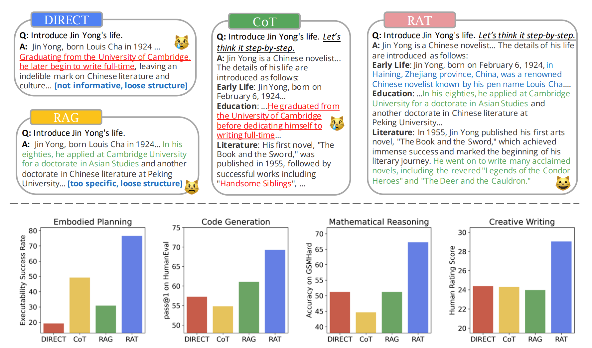

# RAT: Retrieval Augmented Thoughts Elicit Context-Aware Reasoning in Long-Horizon Generation

<div align="center">

[[Website]](http://craftjarvis-jarvis.github.io/RAT)
[[Paper]](https://arxiv.org/abs/2403.05313)
[[Demo]](https://huggingface.co/spaces/jeasinema/RAT)


</div>

## Abstract

We explore how iterative revising a chain of thoughts with the help of information retrieval significantly improves large language models' reasoning and generation ability in long-horizon generation tasks, while hugely mitigating hallucination. In particular, the proposed method — retrieval-augmented thoughts (RAT) — revises each thought step one by one with retrieved information relevant to the task query, the current and the past thought steps, after the initial zero-shot CoT is generated.

## Prerequisites

- Python packages can be installed with `pip install -r requirements.txt`

- `OpenAI_API_key` is required for the language model. You can get it from [OpenAI](https://beta.openai.com/signup/).

```
export OPENAI_API_KEY="sk-******"
```

- You can also use the Huggingface API key for the language model. You can get it from [Huggingface](https://huggingface.co/join).

- You also need to prepare the `GOOGLE_API_KEY` for Google Search API. You can get it from [Google Cloud Platform](https://cloud.google.com/docs/authentication/getting-started).

```
export GOOGLE_API_KEY="********"
```

## Getting Started

You can run the ipython notebook named `creative.ipynb` to generate open-ended creative text with RAT.

You can also use the following code to start a Gradio interface to interact with RAT:

```shell
python app/gradio_app.py
```

## Experimental Results

Applying RAT to various base models substantially improves their performances on various long-horizon generation tasks; on average of relatively increasing rating scores by 13.63% on code generation, 16.96% on mathematical reasoning, 19.2% on creative writing, and 42.78% on embodied task planning.



## Check out our paper!

Our paper is available on [Arxiv](https://arxiv.org/abs/2403.05313). Please cite our paper if you find **RAT** useful for your research:

```
@article{wang2024rat,
    author    = {Zihao, Wang and Anji, Liu and Haowei, Lin and Jiaqi, Li and Xiaojian, Ma and Yitao, Liang},
    title     = {RAT: Retrieval Augmented Thoughts Elicit Context-Aware Reasoning in Long-Horizon Generation},
    journal   = {arXiv preprint arXiv: 2403.05313},
    year      = {2024},
}
```
